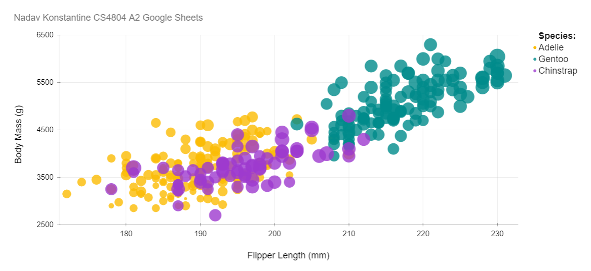
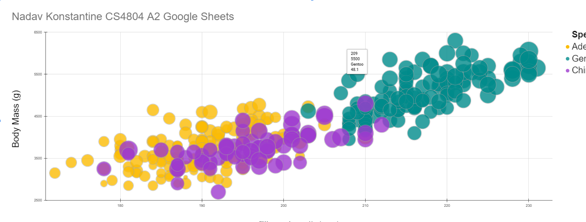
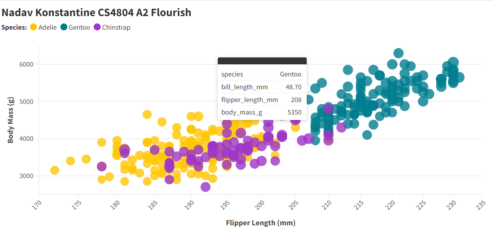
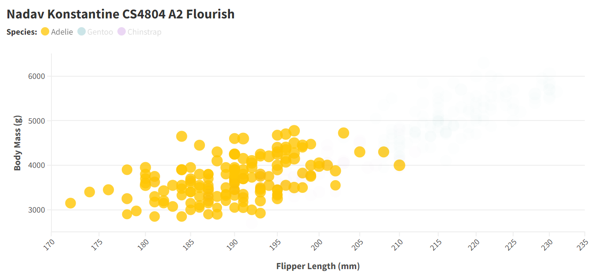
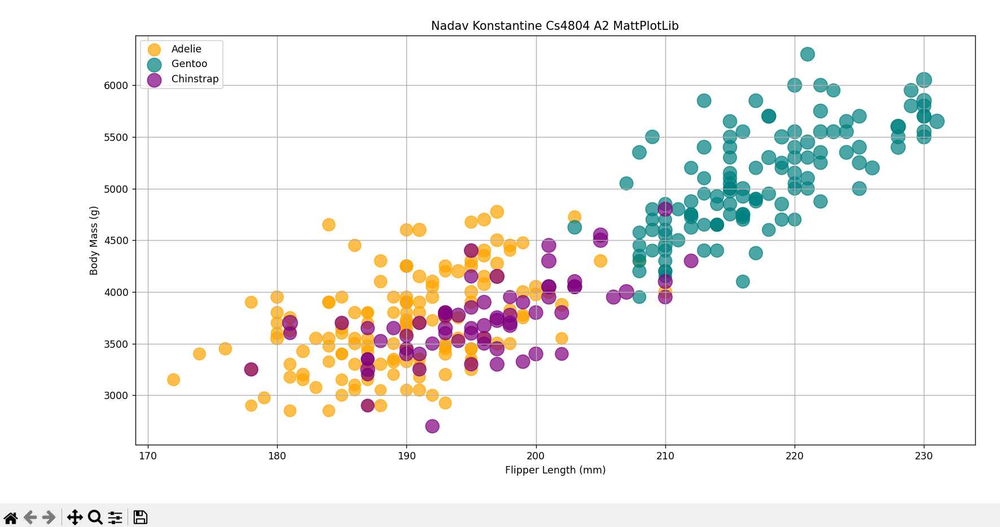
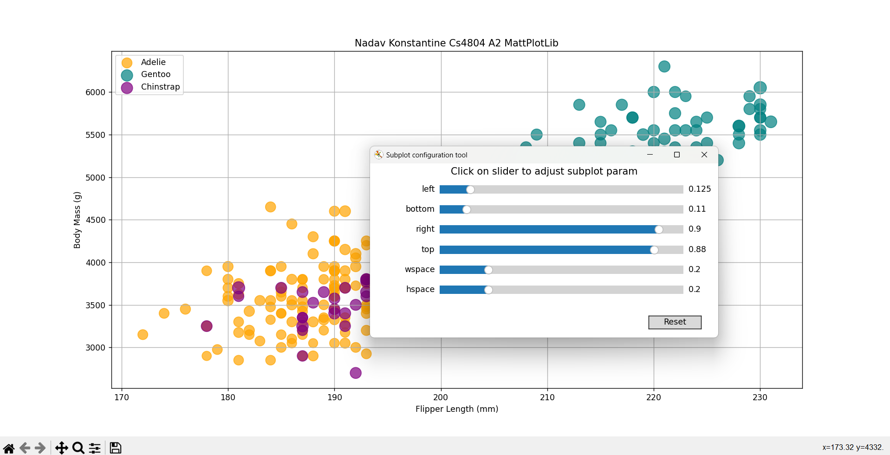
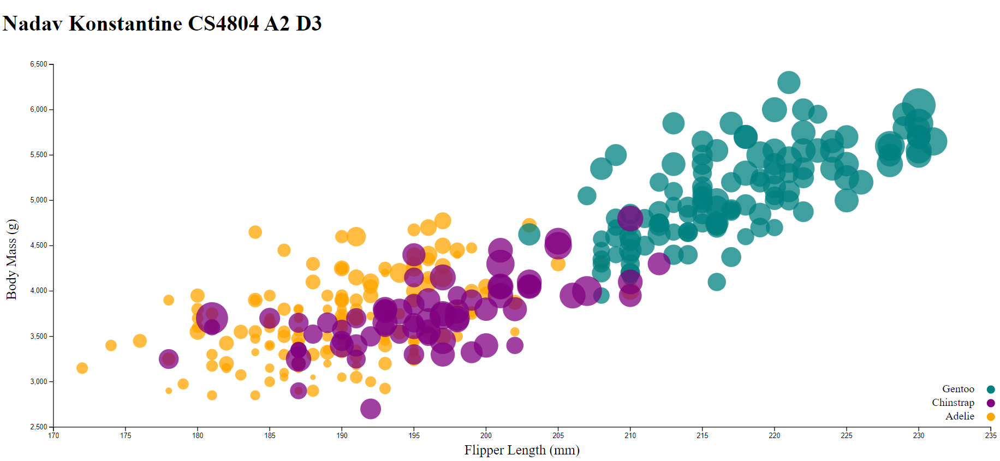
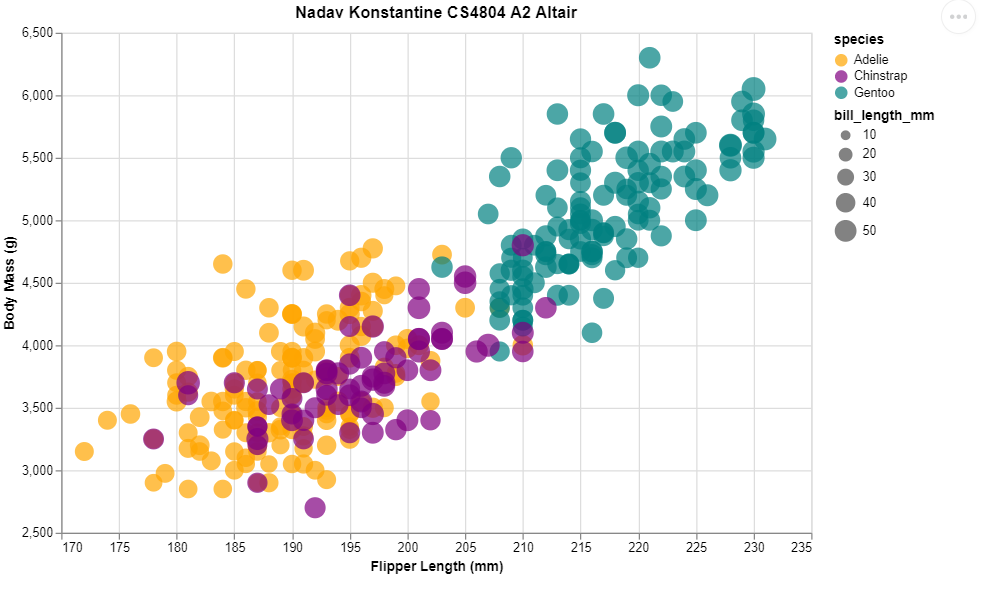

# Nadav Konstantine CS4804 A2 DataVis 5 Ways Submission:
# Google Sheets

Above is my completed version of my first and most time-consuming vis for this assignment; funnily enough, Google Sheets was the most difficult Vis to replicate. Yes, this is a non-coding-necessary method, but I struggled immensely with the concept of separating data on the plot to have all three species color-coded properly. Aside from this extremely lengthy hiccup, all I had to do was select the insert chart and select the necessary data points, separate the X and Y axes as necessary, and customize other configurations for colors and font sizes for the legends, etc. I couldn't figure out how to create a second legend for the bill length sizes for each bubble, but after the requirements and aesthetics were customized in the chart customization menu I made sure to meet all requirements necessary for this assignment. 

**Technical and Design Achievements**

For this Viz, My technical and design achievements were that I was able to implement size scaling for the bill lengths of each penguin, you can see that not every bubble is the same size, and that is because I was able to integrate proper sizing in the chart configurations in google sheets, also, another technical and design achievement as shown below is that I was able to include an interactive feature in the plot, where when I hover over a plot point there is a popup of the specific data stored within that point. Additionally, I precisely selected the colors for each species using the color select tool. All these achievements can be seen in the following image (apologies if it is slightly blurry I do not know how to fix that):

# Flourish

Above is the fully shown replication of the Penglings plot using the online data visualization tool: Flourish. Flourish was an extremely intuitive tool and I was able to complete this vis in an extremely short time. Upon creating an account with Flourish, I was introduced to the multitudes of different vis tables I could choose from, I chose the scatter plot option and all I had to do was upload my CSV file and customize data that was automatically categorized for me. I configured visual aesthetics according to assignment requirements and then played around with the other abilities Flourish had to offer. The online tool gave me a quick guide for how to navigate the different toggle points on the webpage, and all difficulties encountered in Google Sheets were virtually unnoticed in Flourish, while it may not be the most powerful tool out of the bunch I used, it was definitely one of the easiest.

**Technical and Design Achievements**

Below are examples of the technical and design achievements I reached with Flourish. Since the assignment minimum was achieved so quickly, I took more time to add some extra features to the graph, while these are mainly design achievements, I bent some technical limits of flourish by getting formatting exactly how I wanted them to, configuring bill length sizes to alter the bubble sizes, having hover-over popups just like Google sheets, and have a clickable legend that filters the data visualized on the graph by species. As mentioned, these achievements are seen in the images below.

# MattPlotLib

The first coding library I used for this assignment was MattPlotLib, a powerful Python library that I was able to easily read, write, and document a replication of the assignment's plot with a consultation with chatGPT for the syntax of my query building (since I was less acquainted with that part). By reading my CSV file as a pandas dataframe I could then apply a color dictionary to specific iterations of the file's columns through the query. The for loop identified specific species, and then for each species the plt.scatter function plotted each point using the required x and y-axis titles and colors. The size of each bubble was determined through the s variable and then I adjusted the size to my liking. The gridlines and legend for the visuals of the graph were simple, using the plt.grid and plt.legend function calls respectively. I have not struggled too much with this method of visualizing the penglings, and the MattPlotLib documentation has plenty of other useful functions that add to the library's ability to make different types of graphs in Python. 

**Technical and Design Achievements**

The plt.grid function did more than just help me adjust tick marks and gridlines but also implemented an interactive interface that the user can change perspectives of the graph through sliding bars that change the graph view, as well as buttons to reset and reconfigure these changes. An example image of how this works is displayed in the image below.

# D3

Above is the plot I was able to create using the D3 library. For the coding languages used, this one definitely took the longest out of the others I used. I consulted the D3 documentation, chatGPT, GitHub copilot, and stack overflow on numerous occasions for instructions on how I should approach building this plot. CS4804 is my first experience with HTML and JavaScript, so this also took me a considerable amount of time. The standard svg creation was fairly simple, however, I needed to readjust the sizes of the window margins to meet my aesthetic pleasure as well as meet the requirements for the assignment. ChatGPT led me in the right direction for parsing and iterating through the file to place each data point. Next, the D3 documentation provided a basic guide for setting domains, ranges, and labels for both axes. I also learned how to properly buffer the number labels and tick marks on the svg to help the design flow. The colors were simple, I also found a way to do that in the D3 documentation. Stack overflow provided the skeleton code for the 'query' building, plotting each point, adjusting sizes for each dot, setting the color according to each species, and the opacity, of the dots. The species legend took a few tries and a few different approaches that I am not fully sure which actually apply to the image or if they all do. As I write this I acknowledge that I believe the legend took me the longest to figure out during this approach for visualizing the penglings; I needed to create the legend and parse the data by specie on a separate smaller svg, and then append the colored circles and text to it as I saw fit. Meeting the assignment requirements feels like a technical achievement in of itself! 

# Altair

Lastly, the easiest coding library approach I used was the Python library, Altair. Similarly to MattPlotLib, I consulted GitHub copilot to nudge me in the right direction for completing this part, but after parsing the file as a pandas dataframe I could encode the graph very simply. This library differs from MattPlotLib because it generates an HTML page shown via altairPlot.html (which I am not sure will work). In a few easy lines, I could quickly understand the patterns to build the grid, legend, and other assignment-required configurations, and read the dataframe as a parameter to plot each data point. Altair seems like a tool I'd like to read into more since I was interested in learning more about other patterns in the syntax to customize other visualizations, but I still think I would prefer to use MattPlotLib.

**Technical and Design Achievements**

 - Size legend based on bill length
 - HTML file output upon running
 - Gridlines, bolded titles

===
[FUTURE ANECDOTE: Nadav 11/2024 writing a reflection of the pieces here, and I acknowledge the time consumed to perfect this project work, I felt like I properly dipped my toes into each concept covered here and I hope to continue sharpening the skills I gained in this course]

# 02-DataVis-5ways

Assignment 2 - Data Visualization, 5 Ways  
===
Now that you have successfully made a "visualization" of shapes and lines using d3, your next assignment is to successfully make a *actual visualization*... 5 times. 

The goal of this project is to gain experience with as many data visualization libraries, languages, and tools as possible.

I have provided a small dataset about penguins, `penglings.csv`.
Each row contains a penguin observation and several variables about it, including bill length, flipper length, and more.

Your goal is to use 5 different tools to make the following chart:

These features should be preserved as much as possible in your replication:

- Data positioning: it should be a upward-trending scatterplot as shown.  Flipper Length should be on the x-axis and Body Mass on the y-axis.
- Scales: Note the scales do not start at 0.
- Axis ticks and labels: both axes are labeled and there are tick marks at a reasonable interval, e.g 10, 20, 30, etc.
- Color mapping to species.
- Size mapping to Bill Length.
- Opacity of circles set to 0.8 or similar for a semi-transparent effect.

Other features are not required. This includes:

- The background grid.
- The legends.

Note that some software packages will make it **impossible** to perfectly preserve the above requirements. 
Be sure to note where these deviate as you reflect on what a tool is good for.

Improvements are also welcome as part of Technical and Design achievements.

Libraries, Tools, Languages
---

You are required to use 5 different tools or libraries.
Of the 5 tools, you must use at least 3 libraries (libraries require code of some kind).
This could be `Python, R, Javascript`, or `Java, Javascript, Matlab` or any other combination.
Dedicated tools (i.e. Excel) do not count towards the language requirement.

Otherwise, you should seek tools and libraries to fill out your 5.

Below are a few ideas. Do not limit yourself to this list!
There are new tools coming out every year and we may not have an exhaustive list of the latest and greatest.

Some may be difficult choices, like Matlab or SPSS, which require large installations, licenses, and occasionally difficult UIs.

I have marked a few that are strongly suggested.

- R + ggplot2 `<- definitely worth trying`
- Excel
- d3 `<- since the rest of the class uses this, we're requiring it`
- Altair `<- hugely popular python library. highly recommended `
- three.js `<- well, it's a 3d library. not really recommended, but could be interesting and fun`
- p5js `<- good for playing around. not really a chart lib`
- Tableau
- PowerBI
- Vega-lite <- `<- very interesting formal visualization model; might be the future of the field`
- Flourish <- `<- popular in recent years`
- DataWrapper <- `<- popular in recent years`
- GNUplot `<- the former CS department head uses this all the time :)`
- SAS/SPSS/Matlab

You may write everything from scratch, or start with demo programs from books or the web. 
If you do start with code that you found, please identify the source of the code in your README and, most importantly, make non-trivial changes to the code to make it your own so you really learn what you're doing. 

Tips
---

- If you're using d3, key to this assignment is knowing how to load data.
You will likely use the [`d3.json` or `d3.csv` functions](https://d3js.org/d3-dsv) to load the data you found.

**Beware that these functions are *asynchronous*, meaning it's possible to "build" an empty visualization before the data actually loads. Figuring out how to do this properly can be a major hiccup if you haven't used async functions before. If this means you, start part of this project early so you don't end up in a rush!**

- *For web languages like d3* Don't forget to run a local webserver when you're debugging.
See my a1 video or online tutorials for how to do this.
Being able to host a local webserver is an essential web development skill and very common in visualization design as well.

Readme Requirements
---

A good readme with screenshots and structured documentation is required for this project. 
It should be possible to scroll through your readme to get an overview of all the tools and visualizations you produced.

- Each visualization should start with a top-level heading (e.g. `# d3`)
- Each visualization should include a screenshot. Put these in an `img` folder and link through the readme (markdown command: ``.
- Write a paragraph for each visualization tool you use. What was easy? Difficult? Where could you see the tool being useful in the future? Did you have to use any hacks or data manipulation to get the right chart?

Other Requirements
---

0. Your code should be forked from the GitHub repo.
1. Place all code, Excel sheets, etcetera in a named folder. For example, `r-ggplot, matlab, mathematica, excel` and so on.
2. Your writeup (readme.md in the repo) should also contain the following:

- Description of the Technical achievements you attempted with this visualization.
  - Some ideas include interaction, such as mousing over to see more detail about the point selected.
- Description of the Design achievements you attempted with this visualization.
  - Some ideas include consistent color choice, font choice, element size (e.g. the size of the circles).

GitHub Details
---

- Fork the GitHub Repository. You now have a copy associated with your username.
- Make changes to fulfill the project requirements. 
- To submit, make a [Pull Request](https://help.github.com/articles/using-pull-requests/) on the original repository.

Grading
---

Grades on a 120 point scale. 
24 points will be based on your Technical and Design achievements, as explained in your readme. 

Make sure you include the files necessary to reproduce your plots.
You should structure these in folders if helpful.
We will choose some at random to run and test.

**NOTE: THE BELOW IS A SAMPLE ENTRY TO GET YOU STARTED ON YOUR README. YOU MAY DELETE THE ABOVE.**

# R + ggplot2 + R Markdown

R is a language primarily focused on statistical computing.
ggplot2 is a popular library for charting in R.
R Markdown is a document format that compiles to HTML or PDF and allows you to include the output of R code directly in the document.

To visualized the cars dataset, I made use of ggplot2's `geom_point()` layer, with aesthetics functions for the color and size.

While it takes time to find the correct documentation, these functions made the effort creating this chart minimal.

# d3...

(And so on...)

## Technical Achievements
- **Proved P=NP**: Using a combination of...
- **Solved AI Forever**: ...

### Design Achievements
- **Re-vamped Apple's Design Philosophy**: As demonstrated in my colorscheme...
